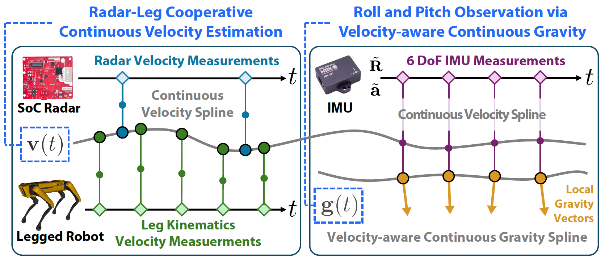
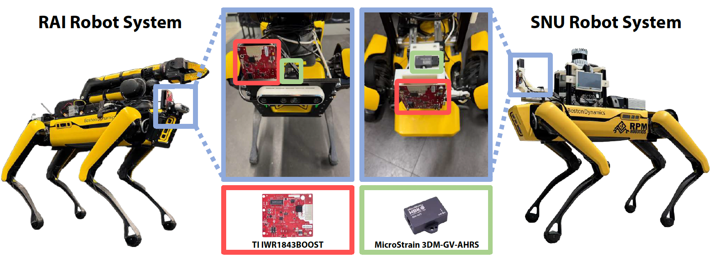

<p align="center">

  <h1 align="center"> <b><em>GaRLILEO</em></b> : Gravity-aligned Radar-Leg-Inertial Enhanced Odometry
 </h1>

  <p align="center">
    <a href="https://github.com/ChiyunNoh/GaRLILEO.git"></a>
    <a href="https://github.com/ChiyunNoh/GaRLILEO.git"></a>
    <a href="https://github.com/ChiyunNoh/GaRLILEO.git"></a>
    <a href="https://github.com/ChiyunNoh/GaRLILEO.git"></a>
    </a>
  </p>

  <h3 align="center"><a href="https://arxiv.org/abs/2511.13216">Arxiv</a> | <a href="https://garlileo.github.io/GaRLILEO/">Project</a> | <a href="https://www.youtube.com/watch?v=SgGc2kqXyaA">Video</a> | <a href="https://garlileo.github.io/GaRLILEO/">Dataset</a></h3>
  <div align="center"></div>
</p>
  <p align="center">
    <a href="https://chiyunnoh.github.io/"><strong>Chiyun Noh<sup>1*</sup></strong></a>
    ·
    <a href="https://sangwoojung98.github.io"><strong>Sangwoo Jung<sup>1*</sup></strong></a>
    ·
    <a href="https://hanjun815.github.io/"><strong>Hanjun Kim<sup>1</sup></strong></a>
    ·
    <a href="https://jeffreyyh.github.io/"><strong>Yafei Hu<sup>2</sup></strong></a>
    ·
    <a href="https://scholar.google.com/citations?user=69iQSpoAAAAJ&hl=en"><strong>Laura Herlant<sup>2</sup></strong></a>
    ·
    <a href="https://ayoungk.github.io/"><strong>Ayoung Kim<sup>1†</sup></strong></a>
    <br/>
    <small><sup>1</sup>Robust Perception and Mobile Robotics Lab (RPM)</small> &emsp;&emsp;
    <small><sup>2</sup>Robotics and AI Institute (RAI)</small>
    <span class="eql-cntrb"><small><br><sup>*</sup>Indicates Equal Contribution</small></span>
  </p>

<p align="center">
  
</p>

This repository contains the code for <b>GaRLILEO: Gravity-aligned Radar-Leg-Inertial Enhanced Odometry</b>. 

<!-- TABLE OF CONTENTS -->
<details open="open" style='padding: 10px; border-radius:5px 30px 30px 5px; border-style: solid; border-width: 1px;'>
  <summary>Table of Contents</summary>
  <ol>
    <li>
      <a href="#abstract">Abstract</a>
    </li>
    <li>
      <a href="#dataset">Dataset</a>
    </li>
    <li>
      <a href="#quick-start">Quick Start</a>
    </li>
    <li>
      <a href="#docker">Docker</a>
    </li>
    <li>
      <a href="#acknowledgments">Acknowledgements</a>
    </li>
    <li>
      <a href="#citation">Citation</a>
    </li>
    <li>
      <a href="#contact">Contact</a>
    </li>
  </ol>
</details>

## Update
[19/11/2025]: Full code of GaRLILEO released.

[30/04/2026]: GaRLILEO is accepted to IJRR. 

## Abstract

<details>
  <summary>click to expand</summary>
Deployment of legged robots for navigating challenging terrains (eg. stairs, slopes, and unstructured environments) has gained increasing preference over wheel-based platforms. In such scenarios, accurate odometry estimation is a preliminary requirement for stable locomotion, localization, and mapping. Traditional proprioceptive approaches, which rely on leg kinematics sensor modalities and inertial sensing, suffer from irrepressible vertical drift caused by frequent contact impacts, foot slippage, and vibrations, particularly affected by inaccurate roll and pitch estimation. Existing methods incorporate exteroceptive sensors such as LiDAR or cameras. Further enhancement has been introduced by leveraging gravity vector estimation to add additional observations on roll and pitch, thereby increasing the accuracy of vertical pose estimation. However, these approaches tend to degrade in feature-sparse or repetitive scenes and are prone to errors from double-integrated IMU acceleration. To address these challenges, we propose <b><em>GaRLILEO</em></b>, a novel gravity-aligned continuous-time radar-leg-inertial odometry framework. GaRLILEO decouples velocity from the IMU by building a continuous-time ego-velocity spline from SoC radar Doppler and leg kinematics information, enabling seamless sensor fusion which mitigates odometry distortion. In addition, GaRLILEO can reliably capture accurate gravity vectors leveraging a novel soft S2-constrained gravity factor, improving vertical pose accuracy without relying on LiDAR or cameras. Evaluated on a self-collected real-world dataset with diverse indoor-outdoor trajectories, GaRLILEO demonstrates state-of-the-art accuracy, particularly in vertical odometry estimation on stairs and slopes. We open-source both our dataset and algorithm to foster further research in legged robot odometry and SLAM.
</details>

## Dataset
<p align="center">
  
</p>
The <b><em>GaRLILEO Dataset</em></b> contains diverse sequences captured by a legged robot equipped with a millimeter-wave radar, IMU, and leg kinematics sensors. It spans indoor and outdoor environments with various elevation profiles, loop trajectories, and motion dynamics. For more details, please refer to the <a href="https://garlileo.github.io/GaRLILEO/">Project Page</a>.

## Quick Start

### Dependency
The code is tested on:
* Linux 22.04 LTS
* ROS2 Humble
* Cers 2.2.0
* PCL 1.13.0
* EIGEN 3.4.0

### Build

```bash
cd ~/ros2_ws
git clone --recursive https://github.com/ChiyunNoh/GaRLILEO.git
git clone https://github.com/SangwooJung98/SPOT_ego_Velocity.git
cd GaRLILEO
chmod +x build_thirdparty.sh
./build_thirdparty.sh
```
> [!IMPORTANT]  
> Before build the project, set the <b>OutputPath</b> in `./GaRLILEO/dataset/{Sequence}/config.yaml` and the <b>default_bag_path</b> in `./GaRLILEO/launch/{the-launch-filename}.launch.py`.


```bash
cd ..
colcon build
source install/setup.bash
```

### Launch

```bash
ros2 launch garlileo {the-launch-filename}.launch.py
```

## Docker
```bash
cd ~/ros2_ws
git clone --recursive https://github.com/ChiyunNoh/GaRLILEO.git
git clone https://github.com/SangwooJung98/SPOT_ego_Velocity.git
```

> [!IMPORTANT]  
>  1. Set **PROJECT_DIR** and **DATASET_DIR** in `./GaRLILEO/docker/run.sh`.
>  2. Set **OutputPath** in `./GaRLILEO/dataset/{Sequence}/config.yaml` to `/root/ros2_ws/results`.
>  3. Set **default_bag_path** in `./GaRLILEO/launch/{the-launch-filename}.launch.py` to `/root/data`.

```bash
cd GaRLILEO/docker
sudo bash ./build.sh
sudo bash ./run.sh

git config --global --add safe.directory '*'
cd GaRLILEO
sudo ./build_thirdparty.sh
cd ..
colcon build
source install/setup.bash
ros2 launch garlileo {the-launch-filename}.launch.py
```

## Acknowledgments
Special thanks to the members of the <b>Robotics and AI Institute (RAI)</b> for their support in conducting experiments and for many insightful discussions. 

Our code is based on <a href="https://github.com/Unsigned-Long/River.git">River</a>.


## Citation

```
@article{noh2025garlileo,
  title={GaRLILEO: Gravity-aligned radar-leg-inertial enhanced odometry},
  author={Noh, Chiyun and Jung, Sangwoo and Kim, Hanjun and Hu, Yafei and Herlant, Laura and Kim, Ayoung},
  journal={The International Journal of Robotics Research},
  pages={02783649261457941},
  year={2025},
  publisher={SAGE Publications Sage UK: London, England}
}
```

## Contact
If you have any questions, please contact:

- Chiyun Noh {[gch06208@snu.ac.kr]()}
